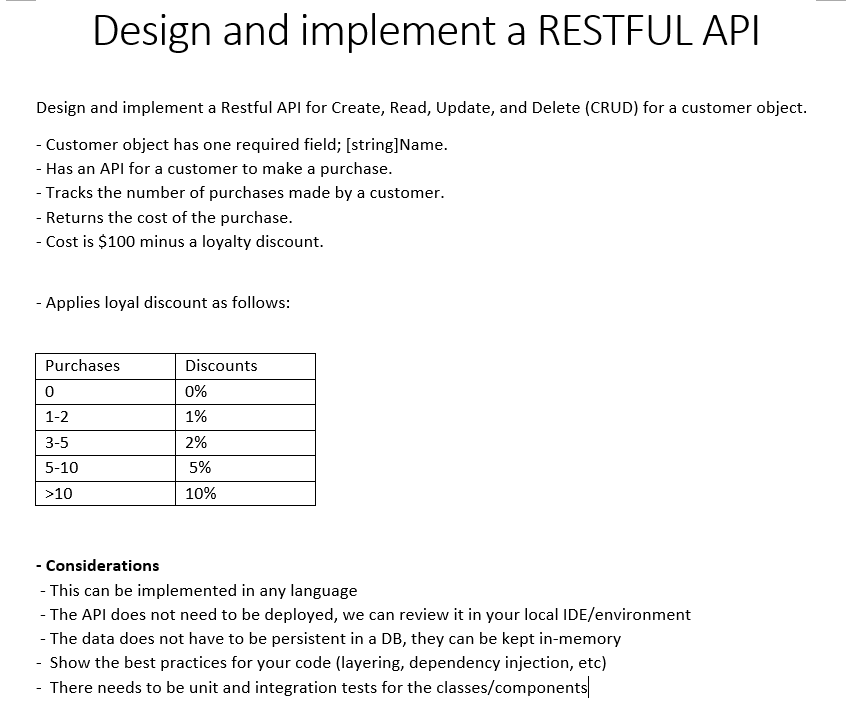

# Readme



## Build With

- Asp net core 6.0

## Getting Started

### Instalation

1. git clone https://github.com/javovazquez/restful-api-example.git
2. Open RestfulApiExample.sln in Visual Studio 2022
3. Restore nuget packages
4. Start Principal project RestfulApiExample.csproj

## Usage

To explore the api only in debug mode use the url http://localhost:5251/swagger/index.html


## Docker

Build Image
```ps
docker build -f "${fullpath}\RestfulApiExample\Dockerfile" --force-rm -t restfulapiexample "${fullpath}\restful-api-example"
```

Run Image
```ps
docker run -d -p 8080:80 --name restfulapi restfulapiexample
```
## Contact

Javier Vazquez - [ojvazquezsanchez@hotmail.com](mailto:ojvazquezsanchez@hotmail.com)
Project Link: https://github.com/javovazquez/restful-api-example
